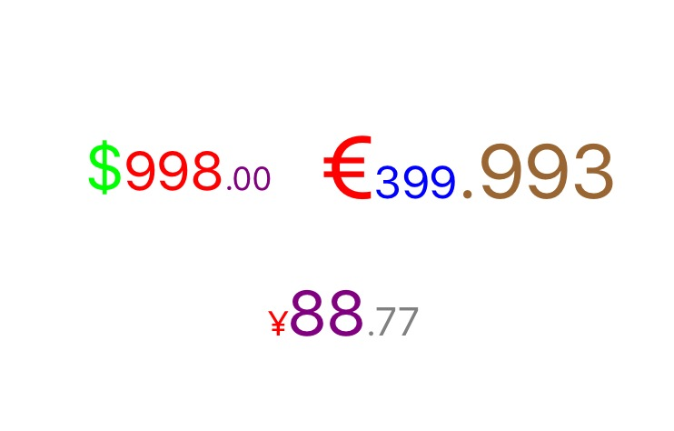

# LPPriceAttributedStringLabel
price with attributedString format util for some money type include /USD / EUR / CNY / GRP

# Install
- `use cocoapods`
```swift
pod 'LPPriceAttributedStringLabel', '~> 1.0.0'
```
``
- `manual`
```swift
just download & drag into your prj
```

# Usage
`Lots of properties for custom follow the sample prj or source code`
```swift
    LPPriceAttributedStringLabel *al1 = [[LPPriceAttributedStringLabel alloc] init];
    al1.frame                         = CGRectMake(50, 200, self.view.frame.size.width, 50);
    al1.moneyType                     = LPMoneyTypeUSD;//USD / EUR / CNY
    al1.integerStringFont             = [UIFont systemFontOfSize:30.f];
    al1.decimalStringFont             = [UIFont systemFontOfSize:18.f];
    al1.integerStringFontColor        = [UIColor redColor];
    al1.decimalStringFontColor        = [UIColor purpleColor];
    al1.moneyTypeStringFont           = [UIFont systemFontOfSize:15.f];
    al1.moneyTypeStringFontColor      = [UIColor greenColor];
    al1.text                          = @"998.00";
```

# Screenshot

